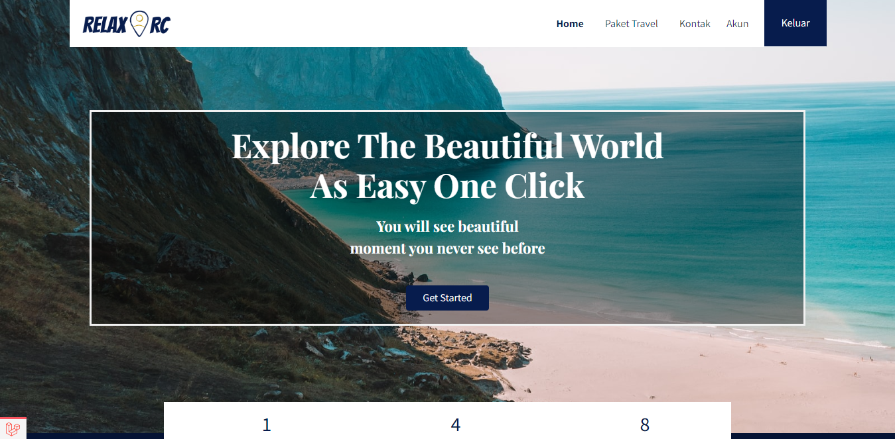
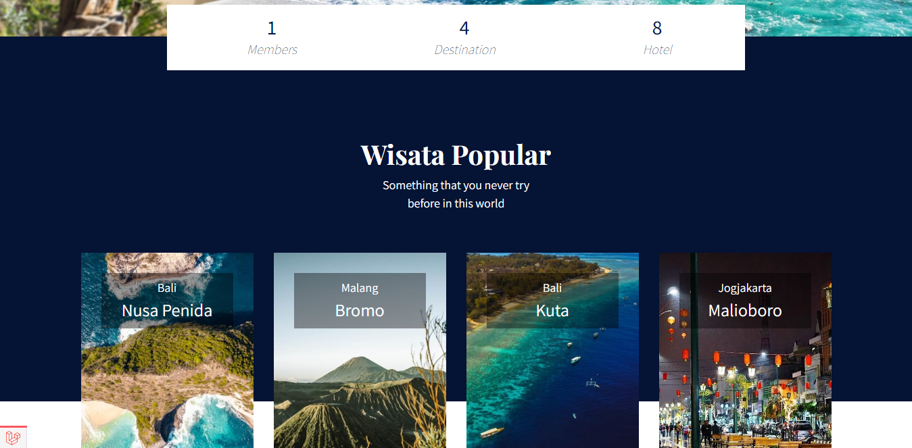
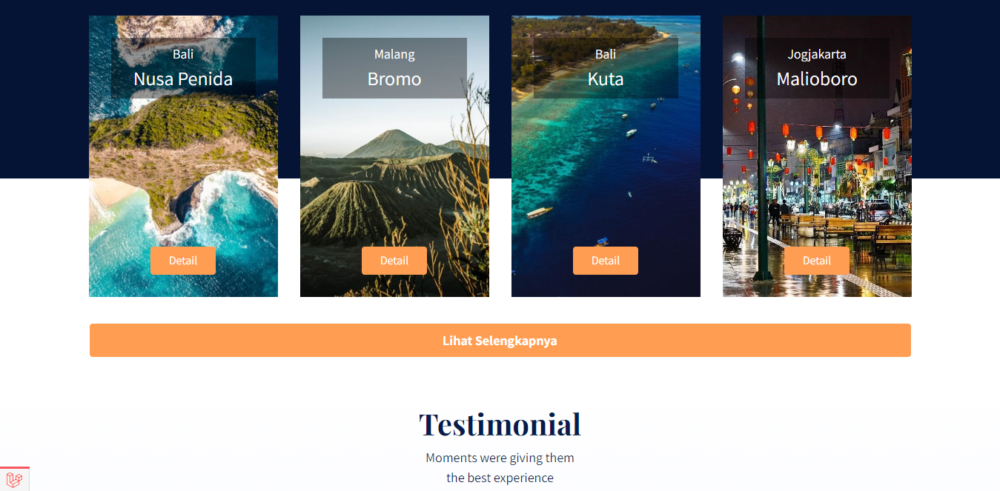
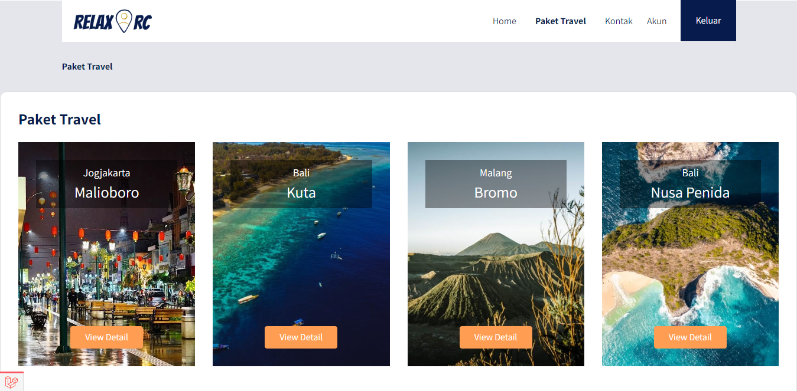
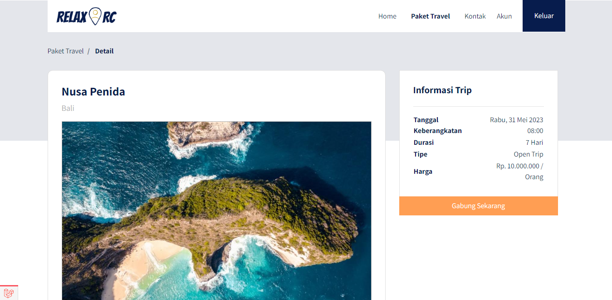
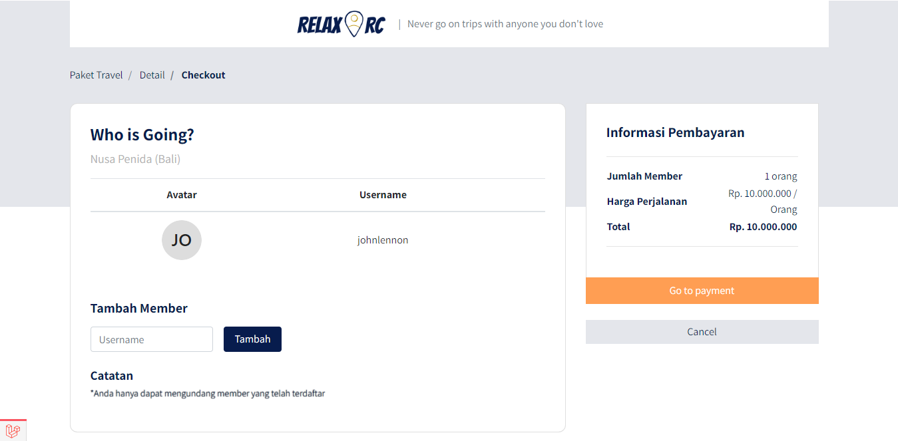
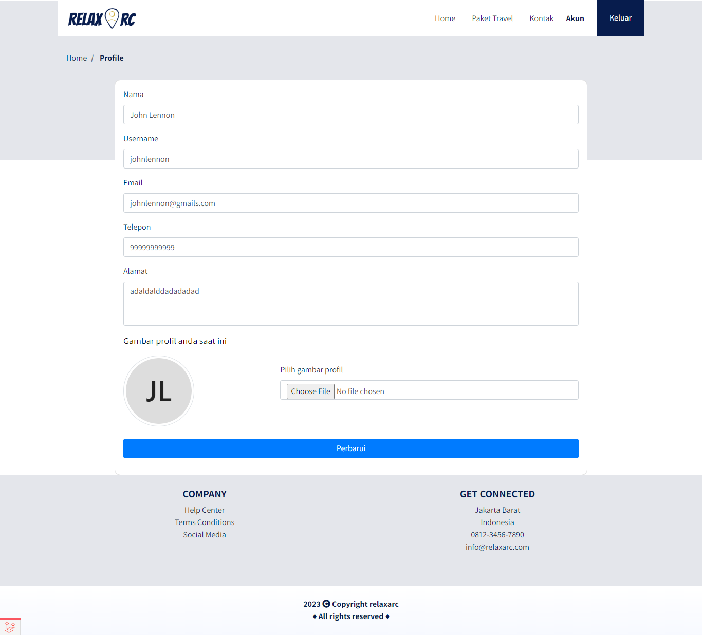
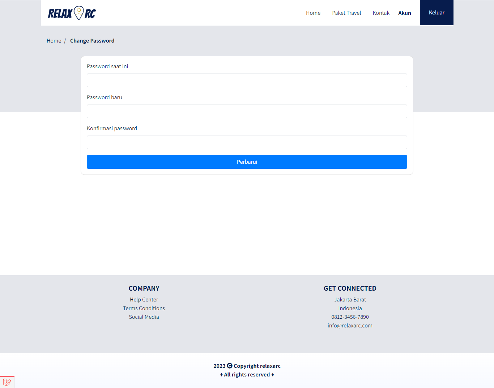
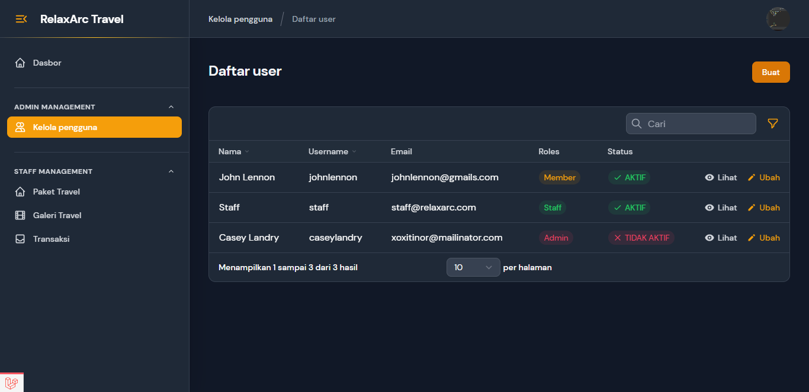

<!-- <p align="center">
  
</p>

# Laravel Travel App Platform

This is a travel app platform I made mostly using Laravel ^8.12 -->

<h1 align="center">
RelaxArc Travel
</h1>

<h5 align="center">
Laravel Travel App Platform.
</h5>

<p align="center">
    <a href="https://github.com/muhammadhabibfery/relaxarc-travel/actions/workflows/test.yml">
    
    <a href="https://www.php.net">
        
    </a>
    <a href="https://laravel.com">
        
    </a>
</p>

</br>

| [Frontend Features][] | [Admin Panel Features][] | [Requirements][] | [Install][] | [How to setting][] | [DB Structure][] | [License][] |

## Frontend Features 



<hr>

<hr>

<hr>

<hr>

<hr>


#### Features

- <b> Home
- <b> Travel Packages
- <b> Travel Package Detail
- <b> Checkout
- <b> Payment
- <b> Change Profile and Password
- <b> Contact

## Admin Panel Features 


|<h3>Menu  </h3>       |       Description                                                                  |
|-----------------------|-----------------------------------------------------------------------------------|
|<b>Dashboard           | </b>Contains information about all menu.                                          |
|<b>User Management     | </b>Manage members and employees.                                                 |
|<b>Travel Package      | </b>Manage all types of travel packages.                                          |
|<b>Travel Gallery      | </b>Manage images for each type of travel package.                                |
|<b>Transaction         | </b>Manage transaction for each type of travel package.                           |
|<b>Profile             | </b>Edit user's profile and password.                                             |

## Requirements

	PHP = ^7.3|^8.0
    laravel = ^8.12
    laravel-ui = ^3.2
    filament/filament = ^2.0
    intervention/image = ^2.5
    midtrans/midtrans-php = ^2.5
    barryvdh/laravel-debugbar: ^3.5

## Install

To deploy your Laravel project using Nginx, MySQL, and an SSL certificate on an Ubuntu server, and then upload a README file to your GitHub repository, follow these steps:

### 1. **Set Up Your Server**
- **Update your server:**
  ```bash
  sudo apt update && sudo apt upgrade -y
  ```

- **Install necessary packages:**
  ```bash
  sudo apt install nginx mysql-server php-fpm php-mysql git -y
  ```

- **Secure MySQL:**
  ```bash
  sudo mysql_secure_installation
  ```
  Follow the prompts to set a root password, remove anonymous users, disallow root login remotely, and remove the test database.

### 2. **Set Up MySQL Database**
- **Login to MySQL:**
  ```bash
  sudo mysql -u root -p
  ```
  
- **Create a database and user for your Laravel project:**
  ```sql
  CREATE DATABASE laravel_db;
  CREATE USER 'laravel_user'@'localhost' IDENTIFIED BY 'password';
  GRANT ALL PRIVILEGES ON laravel_db.* TO 'laravel_user'@'localhost';
  FLUSH PRIVILEGES;
  EXIT;
  ```

### 3. **Set Up Laravel**
- **Clone your Laravel project:**
  ```bash
  cd /var/www/html
  sudo git clone https://github.com/yourusername/your-laravel-project.git
  cd your-laravel-project
  ```

- **Install Composer dependencies:**
  ```bash
  sudo apt install composer -y
  composer install
  ```

- **Set up environment file:**
  ```bash
  cp .env.example .env
  nano .env
  ```
  Update the `.env` file with your database and other configuration details:
  ```env
  DB_DATABASE=laravel_db
  DB_USERNAME=laravel_user
  DB_PASSWORD=password
  ```

- **Generate an application key:**
  ```bash
  php artisan key:generate
  ```

### 4. **Set Up Nginx**
- **Create a new Nginx configuration file:**
  ```bash
  sudo nano /etc/nginx/sites-available/laravel
  ```

- **Add the following configuration:**
  ```nginx
  server {
      listen 80;
      server_name your_domain_or_IP;
      root /var/www/html/your-laravel-project/public;

      index index.php index.html index.htm index.nginx-debian.html;

      location / {
          try_files $uri $uri/ /index.php?$query_string;
      }

      location ~ \.php$ {
          include snippets/fastcgi-php.conf;
          fastcgi_pass unix:/var/run/php/php7.4-fpm.sock;
          fastcgi_param SCRIPT_FILENAME $document_root$fastcgi_script_name;
          include fastcgi_params;
      }

      location ~ /\.ht {
          deny all;
      }
  }
  ```

- **Enable the configuration and restart Nginx:**
  ```bash
  sudo ln -s /etc/nginx/sites-available/laravel /etc/nginx/sites-enabled/
  sudo nginx -t
  sudo systemctl restart nginx
  ```

### 5. **Set Up SSL with Certbot**
- **Install Certbot and the Nginx plugin:**
  ```bash
  sudo apt install certbot python3-certbot-nginx -y
  ```

- **Obtain and install the SSL certificate:**
  ```bash
  sudo certbot --nginx -d your_domain_or_IP
  ```

- **Follow the prompts to configure the SSL certificate.**

### 6. **Set Up Permissions**
- **Give Nginx ownership of the Laravel directory:**
  ```bash
  sudo chown -R www-data:www-data /var/www/html/your-laravel-project
  sudo chmod -R 755 /var/www/html/your-laravel-project
  ```

### 7. **Finalize the Laravel Setup**
- **Run migrations:**
  ```bash
  php artisan migrate
  ```

- **Optimize Laravel:**
  ```bash
  php artisan optimize
  ```


```
composer install
```

Install Nodejs


[Download Node.js](https://nodejs.org/en/download/)


NPM dependencies
```
npm install
```

Using Laravel Mix 

```
npm run dev
```


```

## Database Structure


## License

> Copyright (C) 2022 Muhammad Habib Fery.  
**[⬆ back to top](#laravel-travel-app-platform)**

[Frontend Features]:#frontend-features
[Admin Panel Features]:#admin-panel-features
[Requirements]:#requirements
[Install]:#install
[How to setting]:#how-to-setting
[DB Structure]:#database-structure
[License]:#license
